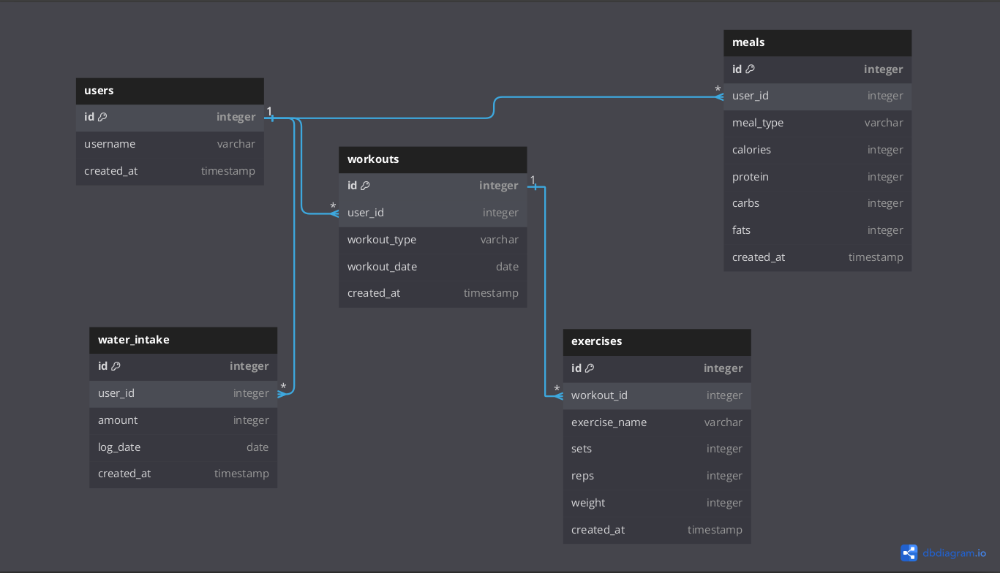

<h1>Fitness Tracker App</h1>

<h2>Overview</h2>

The <strong>Fitness Tracker App</strong> is a command-line interface (CLI) application designed to help users track their fitness journey. It allows users to log workouts, exercises, meals, and water intake, and generate detailed reports of their progress. The app is built using <strong>Python</strong>, with <strong>SQLite</strong> as the database and <strong>SQLAlchemy</strong> as the Object Relational Mapping (ORM) tool.

<video width="400" controls>
  <source src="presentation3.mp4" type="video/mp4">
  Project Presentation
</video>

<h2>Features</h2>
<ul>
    <li><strong>User Management</strong>: Create and manage users.</li>
    <li><strong>Workout Tracking</strong>: Log various workouts with details like type and date.</li>
    <li><strong>Exercise Logging</strong>: Record exercises related to a workout, including sets, reps, and weight.</li>
    <li><strong>Meal Tracking</strong>: Log meals along with calories and macronutrients (proteins, carbs, fats).</li>
    <li><strong>Water Intake</strong>: Record daily water intake (in liters).</li>
    <li><strong>Progress Reports</strong>: Generate and display detailed tabular reports of workouts, meals, and water intake using the <code>tabulate</code> library.</li>
</ul>

<h2>Technologies Used</h2>
<ul>
    <li><strong>Python</strong>: Core programming language.</li>
    <li><strong>SQLite</strong>: Database to store user data, workouts, exercises, meals, and water intake.</li>
    <li><strong>SQLAlchemy</strong>: ORM to interact with the SQLite database.</li>
    <li><strong>Tabulate</strong>: Used to generate pretty tables for reports.</li>
</ul>

<h2>How to Run the Application</h2>

<ol>
    <li>
        <strong>Clone the Repository</strong>:
        <pre><code>git clone https://github.com/yourusername/Fit_Track_CLI_app.git
cd Fit_Track_CLI_app</code></pre>
    </li>
    <li>
        <strong>Set Up the Virtual Environment</strong>
    </li>
    <li>
        <strong>Install Dependencies</strong>
    </li>
    <li>
        <strong>Create Database Tables</strong>:
        To initialize the database and create the required tables, run:
        <pre><code>python create_tables.py</code></pre>
    </li>
    <li>
        <strong>Run the App</strong>:
        To start interacting with the app and log your fitness data:
        <pre><code>python cli.py</code></pre>
    </li>
</ol>

<h2>Database Models</h2>

The app uses the following database tables:

<ul>
    <li><strong>Users</strong>: Stores user information.</li>
    <li><strong>Workouts</strong>: Logs different workouts associated with a user.</li>
    <li><strong>Exercises</strong>: Records exercises (with sets, reps, and weight) linked to a workout.</li>
    <li><strong>Meals</strong>: Tracks meals with calories and macronutrients (protein, carbs, fats).</li>
    <li><strong>Water Intakes</strong>: Logs daily water consumption in liters.</li>
</ul>

<h2>Commands (CLI)</h2>
<ul>
    <li><strong>User Commands</strong>:
        <ul>
            <li>Create a new user</li>
            <li>View all users</li>
            <li>Find a user by ID</li>
        </ul>
    </li>
    <li><strong>Workout Commands</strong>:
        <ul>
            <li> Add Workout </li>
            <li> View Workouts</li>
            <li> Add Exercise</li>
            <li> View Exercises</li>
            <li> Back to Main Menu</li>
        </ul>
    </li>
    <li><strong>Meal Commands</strong>:
        <ul>
            <li>Log a meal with calorie and nutrient details</li>
            <li>View meal history</li>
        </ul>
    </li>
    <li><strong>Water Intake Commands</strong>:
        <ul>
            <li>Record water intake</li>
            <li>View water intake history</li>
        </ul>
    </li>
    <li><strong>Generate Report</strong>: Display a summary of workouts, meals, and water intake in a formatted table.</li>
</ul>

<h2>License</h2>

This project is licensed under the MIT License.

